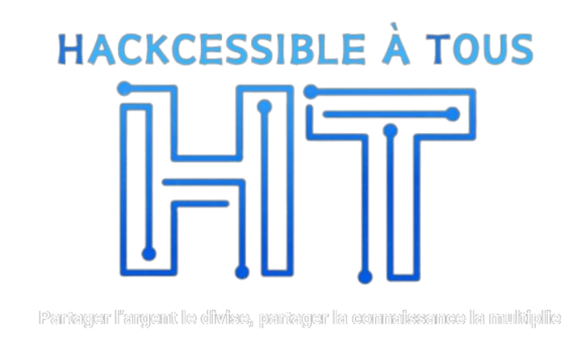

<!-- [Ceci est un commentaire en HTML](https://readme-typing-svg.demolab.com/demo/) -->

<h2>Qui Sommes-Nous ?</h2>

Chez Hackcessible à Tous, nous sommes convaincus que la meilleure défense commence par une compréhension approfondie des techniques tactiques et des procédures d'attaques, ainsi que des aspects cruciaux tels que les réseaux et les méthodes de la blue team. C'est pourquoi nous nous engageons à fournir des ressources éducatives de haute qualité, des formations avancées en cybersécurité, et des conseils pratiques pour renforcer la résilience numérique de votre organisation.

<h2>Notre Mission 👨‍💻🛡️</h2>

Notre mission est de vulgariser le monde de la cybersécurité en fournissant des informations claires, des stratégies éprouvées, et des pratiques exemplaires. Nous visons à autonomiser les individus et les entreprises en les armant avec les connaissances nécessaires pour anticiper, prévenir, et contrer les menaces en ligne.

<h2>Ce Que Nous Offrons 💡</h2>

🎓 **Formations Avancées**: Explorez nos programmes de formation interactifs qui couvrent un large éventail de sujets, de l'énumération et l'exploitation à la sécurisation avancée des réseaux.

📘 **Ressources Pédagogiques** : Accédez à nos tutoriels, guides, et outils recommandés pour approfondir vos connaissances en cybersécurité.

🚨 **Veille** : Retrouvez sur notre page <a href="https://linkedin.com/company/hackcessible-%C3%A0-tous/">LinkedIn</a> toute l'Hacktualité ! des informations incroyables sur le cyberespace. De la présentation de nouveaux outils à la découverte de failles, en passant par l'actualité géopolitique et les avancées en intelligence artificielle, nous vous tenons informés des dernières tendances et développements dans le domaine de la cybersécurité.

<h2>Engagez-vous pour un Avenir Sécurisé! 🌐🔐</h2>

Hackcessible à Tous s'engage à créer un écosystème numérique plus sûr pour tous. Rejoignez nous dans notre mission afin de faire de la cybersécurité une priorité mondiale. Ensemble, nous pouvons transformer les défis numériques en opportunités de renforcement de la sécurité</h2>

###

<h2 align="left">Rejoignez Nous ! 🤝 </h3>

  
  

---

###

  
  

###

###

  
  
  
  
  
  
  
  
  
  
  
  
  
  
  
  
  
  
  
  
  
  
  
  
  
  
  
  
  
  
  
  
  
  
  
  
  
  
  
  
  

###

 

###

  
  

###

<h1 Nombre de Vue 👀</h1>

  <h2>Nombre de Vue 👀</h2>

  

###
